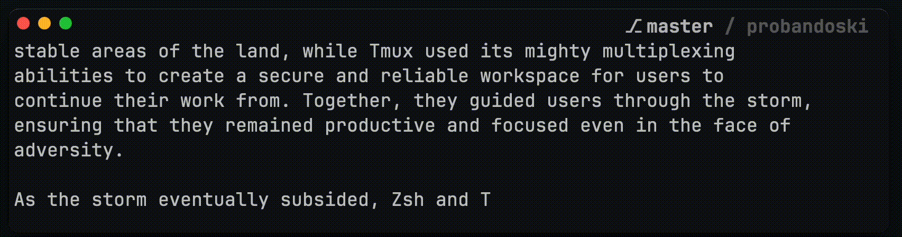

# Your Git workflow with automated repository fetching

This plugin automates the process of fetching updates from remote git repositories, making your coding life a little bit smoother.

Useful when you deal with git repositories that get frequent updates. Instead of the tedious 'git fetch' routine, this handle it for you in the background.


_(play the gif and look top-right just along with `master`: it fetches and the status got updated)_

## Installation

Using [`tpm`](https://github.com/tmux-plugins/tpm/): on your `.tmux.conf` add this line:
```sh
set -g @plugin 'thepante/tmux-git-autofetch'
```
Afterward, install it by pressing `<prefix> + I`.

This installation adds a cron job and a zsh hook to automate the fetching process.

## Usage

Once installed, your open repositories will be automatically fetched in the background every 3 minutes.

## Options

You can add the following options on your tmux config file:

#### `@git-autofetch-skip-paths`

Defines regex pattern to skip specific paths to autofetch.<br>
Default: ` ` (empty)<br>
```bash
set -g @git-autofetch-skip-paths ".*"
```
#### `@git-autofetch-scan-paths`

Defines regex pattern for paths to enable autofetching. Higher priority than `skip-paths` pattern.<br>
Default: ` ` (empty)<br>
```bash
set -g @git-autofetch-scan-paths "~/Projects/.*|.*\/probandoski"
```

#### `@git-autofetch-logging`

Enables or disables debug logging.<br>
Default: `false`<br>
```bash
set -g @git-autofetch-logging "true"
```

With the examples provided, it will write the logging file. Also would autofetch only those repositories inside `~/Projects` and the `anywhere/probandoski` one.

## Notes
- This plugin only fetches updates; it does not perform git pulls nor display info about it.<br>You can display the status using any method you prefer. For instance, you can integrate it with [gitmux](https://github.com/arl/gitmux) for your tmux status bar.
- You can edit the fetching interval by editing the crontab: `crontab -e` and edit the frequency. Default is every 3 minutes (`*/3`).
- For private repositories: ensure that your SSH credentials are correctly configured to avoid fetching rejections.

