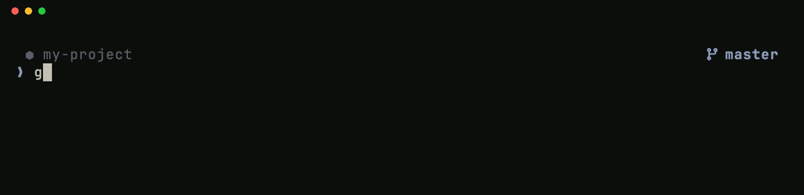

# Your Git workflow with automated repository fetching

A tmux plugin that fetches your open git repositories in the background, so your branch status
reflects the remote without you running `git fetch`.

Useful when you work with repositories that get frequent updates.



_look at how the fetch runs in the background between the two `git status` calls: the status bar 
displays the `↓·2` indicator, and the second call reports the two new commits._

## Installation

To install the plugin with [tpm](https://github.com/tmux-plugins/tpm/), follow these steps:

1. Add this line to your `.tmux.conf`:

   ```sh
   set -g @plugin 'thepante/tmux-git-autofetch'
   ```

2. Press `<prefix> + I`.

The installation adds a cron entry that scans every minute while tmux runs, and appends a hook to
your `~/.zshrc`. It copies your previous `~/.zshrc` to `~/.zshrc.bk_tga` before adding the hook.

## Usage

After you install it, the plugin fetches the repositories open in your tmux panes every 3 minutes.
It also fetches when you change directory into a repository.

## Options

Add any of these options to your tmux config file:

| Option | Description | Default |
| --- | --- | --- |
| `@git-autofetch-scan-paths` | Restricts autofetch to the paths that match this regex. When empty, every path is autofetched. | Empty |
| `@git-autofetch-skip-paths` | Skips the paths that match this regex. When empty, nothing is skipped. | Empty |
| `@git-autofetch-frequency` | Sets the fetch interval in minutes. | `3` |
| `@git-autofetch-logging` | Writes a debug log to `/tmp/tmux-git-autofetch.log`. | `false` |

For example:

```sh
set -g @git-autofetch-scan-paths "~/Projects/.*|.*\/probandoski"
set -g @git-autofetch-skip-paths "~/Projects/vendor/.*"
set -g @git-autofetch-frequency "1"
set -g @git-autofetch-logging "true"
```

That config writes the log, scans every minute, and autofetches only the repositories under
`~/Projects` and any path that contains `/probandoski`, leaving out the ones under
`~/Projects/vendor`.

### Path matching

- Both patterns match against the current directory of each tmux pane, not against the root of the
  repository that directory belongs to.
- `skip-paths` applies on top of `scan-paths`: a path allowed by `scan-paths` is still skipped when
  `skip-paths` matches it. Combine both to enable a whole tree and carve exceptions out of it.
- A pattern matches anywhere in the path, not end to end: `probandoski` also matches
  `/tmp/probandoski-old/src`. Anchor it with `^` and `$` to match the whole path.
- A `~` expands to your home directory.

While `scan-paths` is set, a catch-all `skip-paths ".*"` is ignored, because the pair reads as "skip
everything". If your config has that pair, drop the `skip-paths` line: `scan-paths` alone does the
job.

## Uninstall

Removing the plugin from your `.tmux.conf` stops tmux from loading it, but the cron entry and the
shell hook stay in place. To remove them, follow these steps:

1. Delete the `tmux-git-autofetch` line from your crontab:

   ```sh
   crontab -e
   ```

2. Delete the `tmux-git-autofetch` function and its `add-zsh-hook` line from your `~/.zshrc`.
3. Optional: Delete the cache directory and the log file:

   ```sh
   rm -r /tmp/tmux-git-autofetch-cache /tmp/tmux-git-autofetch.log
   ```

## Notes

- This plugin only fetches: it doesn't pull, and it doesn't display the result. To show the branch
  status in your tmux status bar, use a tool such as [gitmux](https://github.com/arl/gitmux).
- For private repositories, configure your SSH credentials so the remote doesn't reject the fetch.

## Motivation

I work with multiple repositories that get updated frequently, and vscode's autofetch was the
feature that kept me there. I found no equivalent for the terminal, so I wrote this plugin to work
in tmux without missing changes in a repository.

Feedback and contributions are welcome.
